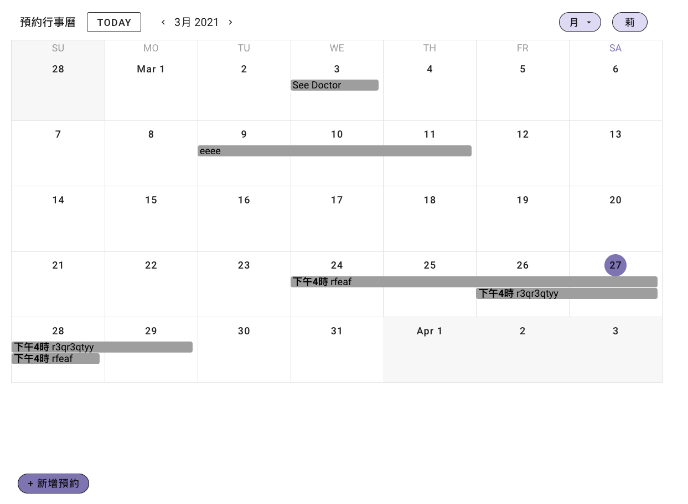

# vue-calendar-demo

預約行事曆 Demo



## Project setup

```
npm install
```

### Compiles and hot-reloads for development

```
npm run serve
```

### Compiles and minifies for production

```
npm run build
```

### Lints and fixes files

```
npm run lint
```

## 已完成功能

- [x] 月行事曆、週行事曆、日行事曆
- [x] 可自由切換行事曆切換
- [x] 可新增預約
- [x] 手機排版

## 備註

1. 若無法新增預約，很有可能是後端資料庫已關閉
2. Deploy on Netlify
3. 資料庫使用 Firebase
4. 使用 Vuetify Calendar Componet

## References

[1] https://github.com/jsfanatik/vuestacks-calendar-vue-firebase

[2] [Build a Calendar With Vue, Vuetify & Firebase. Traversy Media](https://youtu.be/2NOsjTT1b_k)

[3] [How to change day-format (M > Mo, F > Fr…) in Date/month pickers of Vuetify](https://stackoverflow.com/questions/57577813/how-to-change-day-format-m-mo-f-fr-in-date-month-pickers-of-vuetify)